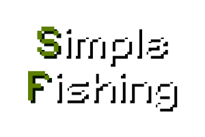

# Simple Fishing Modpack
Modpack for Luanti and minetest_game that adds fishing mechanic, along with an
API to easily add your own fishing rods, fish and treasures.

Default pack provides 3 different kinds of fish (5 if
[df_caverns](https://github.com/FaceDeer/dfcaverns) is installed) and 2 fishing
rods (5 if 
[simple_materials](https://codeberg.org/fruitsnack/simple_materials) and 
[moreores](https://github.com/minetest-mods/moreores/) are installed).



## Requirements
### Mandatory

- [Luanti](https://www.luanti.org/downloads);
- [minetest_game](https://github.com/luanti-org/minetest_game).

### Optional

- [moreores](https://github.com/minetest-mods/moreores/);
- [3d_armor](https://github.com/minetest-mods/3d_armor);
- [moretrees](https://github.com/mt-mods/moretrees);
- [simple_materials](https://codeberg.org/fruitsnack/simple_materials);
- [df_caverns](https://github.com/FaceDeer/dfcaverns).

## How to use
After installing the modpack, default fishing rods should be available for
crafting. Their crafting recipes can be viewed with inbuilt minetest_game
craftguide.

To start fishing, go to any body of water, equip any fishing rod and press
left mouse button. This will throw a hook. The hook should have at least 4
nodes of water (by default) beneath it for fishing to work. By default, the
hook will float above water and wave. At some point it will start bobbing and
spawning particles, indicating that the fish is caught. If left mouse button is
pressed again before the timeout runs out, the fish will be caught.

There is a small chance to catch a treasure instead of fish. Different fishing
rods have different chances of catching fish and treasure, usually increasing
with fishing rod material.

Default pack also provides 5 different kinds of fish, 3 for base game and 2
more for df_caverns. Default fish will only spawn in overworld, while
df_caverns fish will spawn in df_caverns Y levels.

All default fish can be cut into steaks, which can be cut into fillets. Both
can be cooked in a furnace. For exact recipes refer to in-game craftguide.

Default pack also registers different treasures for different layers
(overworld, underground) and integrates loot from some mods like 3d_armor,
moretrees, etc.

## Settingtypes
`simple_fishing` provides configuration options, accessible either in Luanti
client settings or by putting configuration options and their values
directly into your `minetest.conf`.

Full list of options, along with their documentation and possible values
is available in this file: [settingtypes.txt](simple_fishing/settingtypes.txt), 
located in `simple_fishing/settingtypes.txt` in this repository.

## Integration with other mods (API)
`simple_fishing` provides these public functions:

```
--------------------------------------------------------------------------------

simple_fishing.register_fishing_rod(def):

- def is a table with following fields:

{
    name, string,                   - id of the new tool;
    description, string,            - visible name in inventory;
    inv_texture, string,            - inventory texture;
    wield_texture, string,          - wield texture;
    wield_texture_active, string,   - wield texture with fishing hook deployed;
    wield_scale, float,             - wield scale;
    sound_use, string,              - sound played on use;
    sound_return, string,           - sound played on use when active;
    sound_gain, float,              - gain of use and return sounds;
    uses, int,                      - amount of uses before fishing rod breaks;
    chance, float,                  - chance per interval to catch fish;
    treasure_chance, float,         - chance of an already triggered catch to
                                    - turn into treasure;
    length, float                   - max lengh of fishing line.
}

--------------------------------------------------------------------------------


simple_fishing.register_fish(def, treasure):

- def is a table with following fields:
{
    name, string                    - id of corresponding fish;
    y_min, int                      - minimum Y for fish to spawn;
    y_max, int                      - maximum Y for fish to spawn;
    heat_min, float                 - minimum heat for fish to spawn;
    heat_max, float                 - maximum heat for fish to spawn;
    biomes, table                   - a table with biome names in wish fish
                                    - should spawn.
}
- treasure, bool - if this item should be a regular fish or treasure.

Note: only name field is required, the rest can be omitted.

--------------------------------------------------------------------------------

simple_fishing.register_treasure(def):

Wrapper for simple_fishing.register_fish() but with 'treasure' as true.

--------------------------------------------------------------------------------
```

## License And Credits
All code and visual assets in this repository are made by Fruitsnack, unless
stated or implied otherwise in:

- "License And Credits" section in README (this section);
- Individual file headers;
- Git commit history;
- Merge requests and other means of contribution (i.e. by mailing patches).

Code and text files that are made by Fruitsnack are licensed
under AGPL-3.0-only.  
Full text of the license is available in this file: 
[LICENSE-AGPL-3.0-ONLY](LICENSE-AGPL-3.0-ONLY) in this repository, or, 
alternatively, [here](https://www.gnu.org/licenses/agpl-3.0.en.html).

Assets and media files that are made by Fruitsnack are licensed
under CC-BY-SA-4.0.  
Full text of the license is available in this file: 
[LICENSE-CC-BY-SA-4.0](LICENSE-CC-BY-SA-4.0) in this repository, or, 
alternatively, [here](https://creativecommons.org/licenses/by-sa/4.0/).

CC0-licensed sounds from following users of freesound.org were mixed, cut,
edited and otherwise used to produce sounds in this modpack:

- Epicwizard - water_paddle_heavy_29.wav - simple_fishing_water_splash.ogg
- Nightflame - swinging_staff_whoosh_low_07.wav -
simple_fishing_default_whoosh.ogg

Produced sounds are licensed under CC-BY-SA-4.0.  
Full text of the license is available in this file: 
[LICENSE-CC-BY-SA-4.0](LICENSE-CC-BY-SA-4.0) in this repository, or, 
alternatively, [here](https://creativecommons.org/licenses/by-sa/4.0/).

Full text of CC0 1.0 Universal license is available in this file: 
[LICENSE-CC0](LICENSE-CC0) in this repository, or, 
alternatively, [here](https://creativecommons.org/publicdomain/zero/1.0/).

`screenshot.png` was made by Fruitsnack using 
[Pixelify-Sans](https://github.com/eifetx/Pixelify-Sans) font by 
Stefie Justprince, licensed under OFL-1.1.  
Full text of the license is available in this file: 
[LICENSE-OFL-1.1](LICENSE-OFL-1.1) in this repository, or, alternatively, 
[here](https://openfontlicense.org/open-font-license-official-text/).

```
    Simple Fishing - Modpack for Luanti and minetest_game that adds fishing
    Copyright (C) 2025 Fruitsnack

    This program is free software: you can redistribute it and/or modify
    it under the terms of the GNU Affero General Public License version 3 as
    published by the Free Software Foundation.

    This program is distributed in the hope that it will be useful,
    but WITHOUT ANY WARRANTY; without even the implied warranty of
    MERCHANTABILITY or FITNESS FOR A PARTICULAR PURPOSE.  See the
    GNU Affero General Public License for more details.

    You should have received a copy of the GNU Affero General Public License
    along with this program.  If not, see <https://www.gnu.org/licenses/>.
```

Link to the original source code repository: 
https://codeberg.org/fruitsnack/simple_fishing
